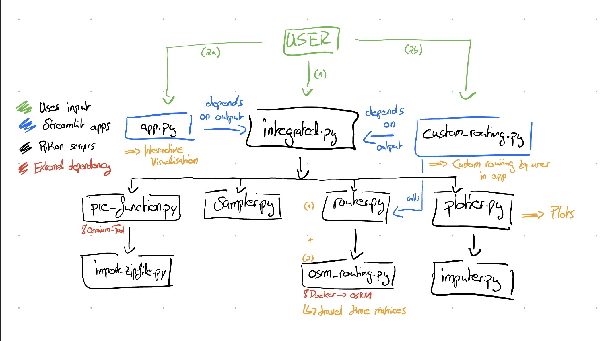
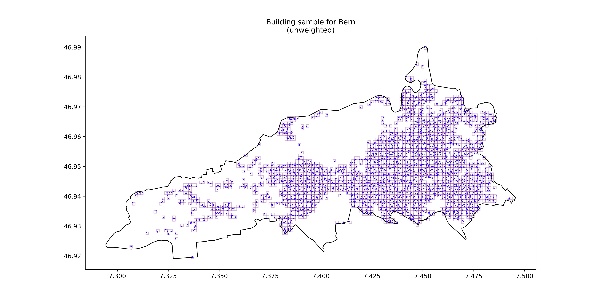
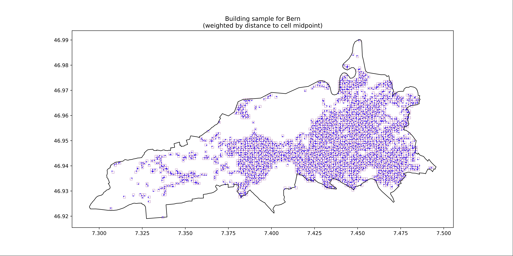
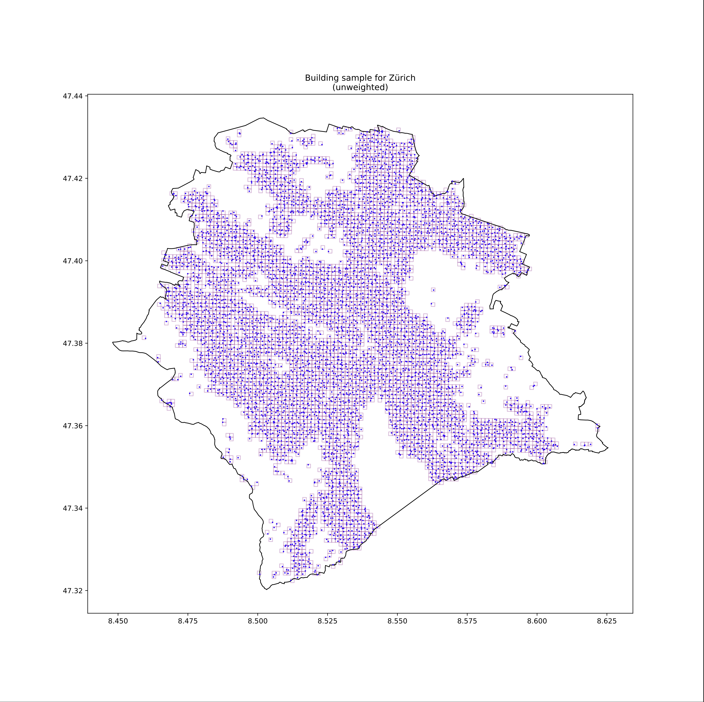
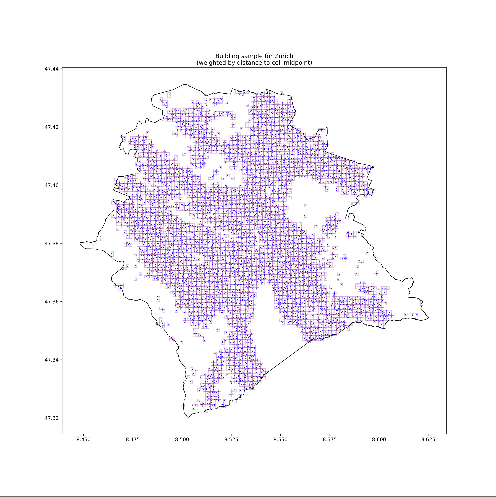
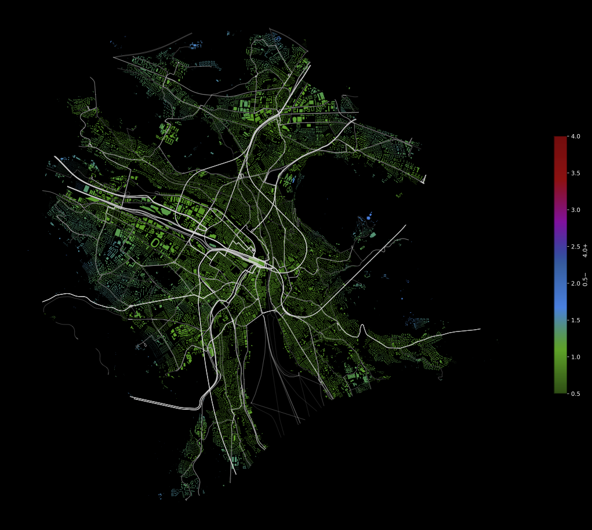
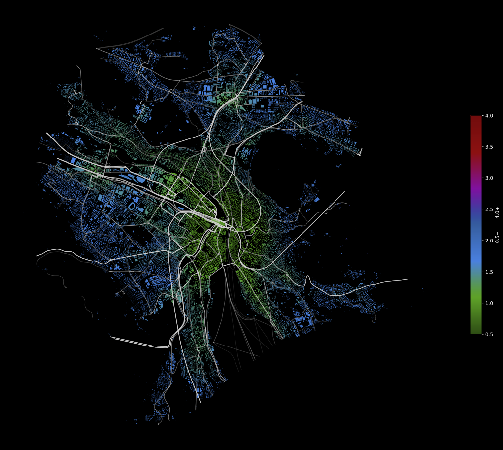
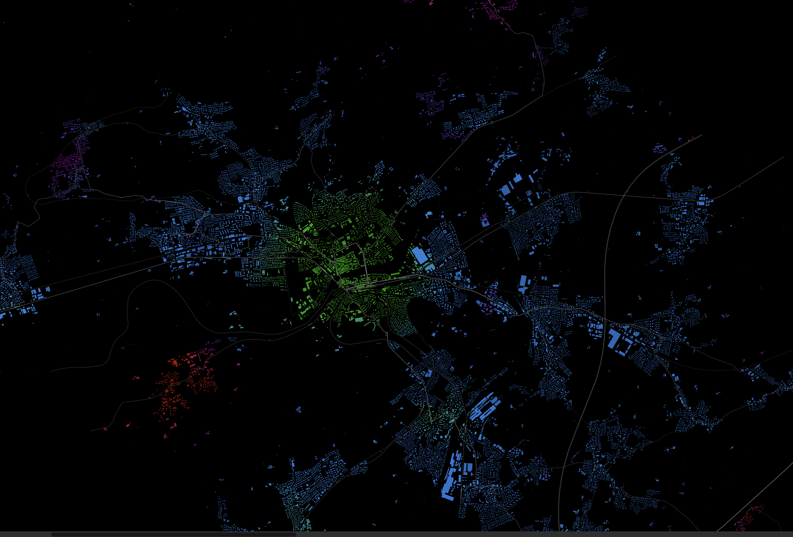
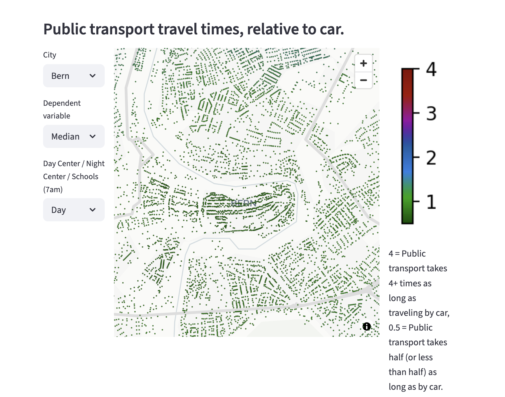
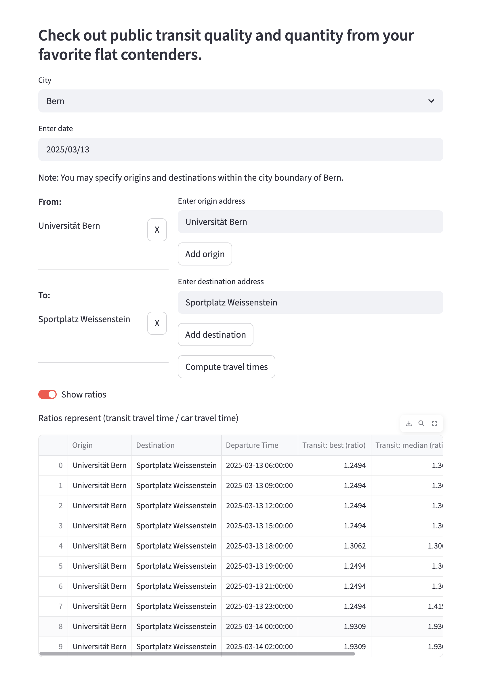

# Motivation

Daniel Keim's lab published a tool called "Mobility Maps" which I found interesting: They computed walking times to a nearest transit stop for all buildings in Germany. Fun, I thought, but not very helpful. If I were to be able to walk to my next transit stop within 5 minutes but the next bus would only pick me up in 5 hours, I better take the car or even walk. So I wanted to do something similar, but also routing actual travel times by transit times. This would allow me to observe difference between, and, most importantly, within cities for further analysis. Using sub-city-level sociodemographic data for example, differences in public transport coverage could be explained. So this is to be thought of as a gateway-tool for doing some (I think) pretty cool analyses. P.S.: The plots are also really pretty.

# Design

## integrated.py

This script has three primary functions: [1] **File management**: Copies user-provided files (e.g. Open Street Map (OSM) data and GTFS-feed) into the correct subdirectories and verifies copying worked. It then checks whether all optional files which should have been provided by cloning the git repository are in their correct locations and alerts the user otherwise. I have decided to (a) not provide these files from the github repository as they are too large and (b) to not rely on any function I write to properly handle interrupted downloads. Especially the OSM data file is quite large (~500MB) so I deemed it best for the user to decide how (and when) to properly download it. [2] **User input**: Take user-specified parameters and call only necessary (and allowed) functions from other files given these inputs. As part of that, it handles loading previously computed data if parts of the pipeline are skipped by the user. In that case, it also handles cases where the user skips parts he should not skip and exits the program gracefully, complimenting the user on their great input specification on the way out.  [3] **Global constants**: Defines global constants it then passes to each function that requires them instead of re-assigning constants across multiple scripts. This then makes changing specific parameters globally easier, like which cities are available, which dates are covered by the GTFS-feed or which path OSM files are to be found under. It also defines the function which converts a city input like "Zürich" into a filename-worthy string like "zuerich". This is then used throughout other scripts where the processed string cannot be passed directly as input (e.g. in app.py and custom_routing.py). 

Once this script has run through, all necessary data for running `app.py` and `custom_routing.py` is available. 

## pre_function.py

This script consists of a two functions of which the more important one is `pre_processing()` which is called by `integrated.py`. It retrieves all necessary data via [OSMNX](https://osmnx.readthedocs.io/en/stable/) (which itself calls the [Nominatim API](https://nominatim.org/), an open-source geocoding API which works with OpenStreetMap Data) and from local storage. While OSMNX is able to provide all data (except for the GTFS feed) itself, I choose to instead rely on the local copy of OSM data wherever possible and merely "abuse" osmnx for its simple Nominatim integration which allows me to easily geocode places. In this case, I only use it to extract the approximate boundary for the specified city, which is easier and more flexible than accounting for all possible cases in the administrative boundaries of the local OSM data. It also, most often, provides the "wanted" result even if the specification of the city is not very well formulated. Additionally, it allows for quite flexible switching between administrative levels: While specifying "Zürich" yields boundaries for the city Zurich, specifying "Kanton Zürich" or "county='Zürich', country='Switzerland'" would yield the boundary for the Kanton Zurich, all done through natural language without requiring to specify administrative levels manually. 

I have not found a good (installable) way to process OSM data from within python, which is why I use the external tool Osmium Tool. I call it through subprocess (which I looked up how to do that, in general) and the result is stored as a .osm.pbf file which than can be used by the following functions. I figured out how to extract a boundary from bounding box coordinates from its documentation and basically construct the terminals tring in Python. I then extract buildings and places from the local OSM data using pyrosm, which allows filtering by tags. They are also converted to point geometries using a "representative" point within their polygon which is not quite the centroid but rather something guaranteed to obey its boundaries. I don't quite know how that works, but geopandas handles it gracefully. Separate geodataframes are kept with either the polygon (buildings) *or* the point (origins) as their geometry because for some subsequent operations, geopandas does not allow for multiple geometry columns. I define buildings as *any and all* buildings cartographed, including huts in the woods and military bases. Public transport should not discriminate. These are then filtered and processed so they do not cause errors later on and made "reachable" so a point cannot lie in the middle of a sea without an island underneath it.  This usually doesn't do anything and acts as a safety net. This "reachability" processing can only be done after having computed a transport network using r5py. This is only possible if there is a valid GTFS-feed available, so before doing this, 'pre_processing()' calls 'fix_gtfs' from 'import_zipfile'. More on how that works later. 

The function returns the boundary, buildings, origins and the the center point for the city as geodataframes to `integrated.py`.

The second function, `origins_to_schools` maps origins to the closest school within their school district. I use official data from the cities of Bern and Zurich for the locations of schools, but only Bern consistently specifies the type of a school, thus I do not filter by this information. This then makes the results a bit less interesting because yes, sure, it is easy to get to *any* school from most location, just not maybe the one you are interested in. The function obeys mappings of origins to school districts (for which the data is also provided by the cities' open data platforms). I use geopandas' `sjoin()` function to merge origins to schools, which is very fast. The function returns the origins with an identifier for their nearest school added, as well as the locations of the schools where the former then can be used as origins and the latter as destinations for routing in later steps. 

## import_zipfile.py

This script performs a single function: `fix_gtfs()`. GTFS-feeds are not very standardised and occasionally littered with inconsistencies. This is less so case for Swiss GTFS-data but I started with German GTFS feeds and they needed quite a bit of cleanup. GTFS feeds are basically a bunch of csv files which are thus quite intuitively manipulateable. r5py does not give out interpretable errors for malformed GTFS-feeds, so this has mostly been constructed through trial and error. Now, some extreme values (like trips longer than 47:59 hours) are dropped and columns coerced to a different type. While this is being done, the main goal of the function is to clip the feed to the geographic area of interest to make constructing r5pys' transport network considerably faster (the same reason the OSM data is being clipped). To do this, I use the stops coordinates to identify those within the bounding box and then keep their parent stops as well (if data on them is available). I filter all other parts of the feed to only keep those values which are used by routes / trips / stops within the bounding box. The script writes the resulting GTFS-feed as a zip-File. 

## sampler.py

This script consists of a single function, `grid_sampler()` which starts off by creating a grid of cells with width=height (as specified by the user through the `--cell int` option) from the bounding box of the area of analysis. It then takes the midpoint (I used 'representative point' which ensure the point lies within cell to be safe, but the 'centroid' would have been fine as squares are not unusual geometries) of each cell. I then (1) match origins to cells using geopandas `sjoin()` and compute distances from each origin to their respective cell midpoint. I then use the inverse of the distance to the cell midpoint as a weight when sampling one point from each cell. This is done so that points close the middle are preferred. It would be even simpler to just use the midpoint of the cell as the sample point, but it is important to me that only "real" buildings (the irony is not lost on me that in edge cases, a hut made for cows may be viewed as a building) are used for routing later on. This is especially important at the edge of the sampling area as there, a grid may span well outside the area boundary and only intersect a small part. The difference in sampling can be seen from the figures below in examples for Bern and Zurich. The function returns the sample of origins without any additional columns added from the input. 

|  |  |
|---|---|
| Building sample for Bern (unweighted) | Building sample for Bern (weighted by distance to cell midpoint) |

|  |  |
|---|---|
| Building sample for Zurich (unweighted) | Building sample for Zurich (weighted by distance to cell midpoint) |

## router.py

This script handles everything regarding transit routing and high-level tasks for driving and walk routing and defines the three functions `route_center()`, `route_schools()` and `route_custom()` to perform similar tasks with slightly different requirements. Here, to be fair, they may could have been written as one function is more if else statements, but I felt like this provided better readability.

First things first, `route_center()` takes in multiple origins and one destination from the previous steps and computes transit, driving, and walking times for a variety of timepoints across a day (between 6:00am and 02:00am (next day)). Transit routes are computed for every origin whereas whether driving or walking routes are computed depends on distance of an origin to the destination. Transit routing is performed by r5py's `TravelTimeMatrix()` function, which uses an adaptation of the [RAPTOR algorithm](https://www.microsoft.com/en-us/research/wp-content/uploads/2012/01/raptor_alenex.pdf) to RAPidly (is that where it got its name?) compute transit routes between origins and destinations. Because of this, r5py is very efficient at computing transit routes, but is not at all efficient at computing driving and walking routes. I am not sure why that is, but I have thus decided to use OSRM to accomplish this task. Calling OSRM is outsourced to the file `osrm_routing.py` and is covered below. OSRM computes walking routes for every origin within 500m distance to the destination and driving routes for all others. This is due to the way I present results in the visualisation part: As a ratio between transit travel time and driving / walking travel time. This, when using driving travel times for every origin, results in very "badly covered by public transit" areas close to the destination because a wait time of one minute is suddenly horrific compared to half a minute driving. I make the assumption that no one who would be considering public transit (e.g. not moving into a new flat) would use their car for a trip of 500m or less and that walking time would be a more fair comparison. In addition to this, I administer a 10min penalty on top of driving times to account for traffic, parking and similar mild inconveniences associated with commuting in a metal box. Because r5py uses walk routing for transit time calculation as well (to get to a stop, between stops, or from last stop to destination), both r5py and OSRM use a walking speed of 5km/h. The function returns a combined travel time matrix with both transit and driving / walking (one column, mode dependent on distance to destination) travel times for each origin.

The second function, `route_schools()` essentially mirrors `route_center()` but handles origin-school pairs (so neither all origins -> one same destination nor all origins -> all destinations) by comuting a travel time matrix per school for all of its assigned origins and row-binding afterwards. 

Finally, `route_custom()` is identical in setup for the transit routing as `route_center()`, because r5py supports all origins to all destinations, but differs in how it calls the OSRM routing so that it can handle all origins to all destinations which is possible as the user can specify a (theoretically) unlimited number of origins and destinations. It is not possible to restrict routing to specific origins for destinations like in `route_school()`.

All routing functions provide best case (5%-percentile), median case, and worst case (95%-percentile) travel times which are the respective percentiles from a 30-minute window after departure time. Travel time by car and foot never change.

## osrm_routing.py

OSRM is a routing engine written in C++ which I have decided to run in Docker. This is due to several reasons, to name a few: [1] Building OSRM from source alone takes longer than the allowed 10min setup, [2] OSRM runs natively on Linux, not very much so in Windows without using WSL, and [3] using Docker makes it very easy to use as it just runs as a local server and can be called via an API. This makes prompting it from Python very easy. Possible reason for a native install would be to increase performance (even more) but given it finishes processing of 160.000 origins to one destination in under a second using docker, I do not feel the need. 

The first function, `setup_osrm()` maps data directory to docker, sets up OSRM server on separate port for the correct profile (walking / driving). Preprocesses the OSM data for routing if not skipped, then starts osrm routing server. `stop_osrm()` does what its name suggests and stops the active container whose ID it is given as input. `osrm_route()` chooses the correct routing server, converts points from origins and destinations to longitude and latitude, then calls the routing engine. Response (travel times) are parsed from json and added to origins dataframe. `osrm_process()` defines the logic for doing OSRM routing for a set of origins, splitting them into walking / driving group by distance to destination, adding driving time penalty and appending results back together. Handles if there are either no origins in walking or in driving scope. `osrm_process_schools()` mirrors the previous function but handles the separate destinations for origins depending on closest school. Otherwise identical. The last two functions could have been combined, I found them more readable this way.

## imputer.py

This script consists of one function which does one-and-a-half jobs. Its primary task is to impute travel time data for all unsampled points, given I only compute "real" data for a small sample due to computational limitations. The imputation is done by weighting the values by inverse distance from an unsampled points' five (approximate) nearest, sampled neighbors which are calculated using scipys' KDTree function which is very efficient. Points for which all five nearest sampled neighbors have only NA values - thus are not reachable by public transit in the given case - are also set to NA, given it is a substantive insight. A secondary task is to join back the polygon geometries to the dataset so that plotting can take advantage of them. I choose to do it here because I view the imputation function as the pre-processing step for plotting, although the second task is not clearly related to imputation. The function returns a geodataframe with all buildings in the area of interest and their respective "real" and imputed travel times as well as identifiers for whether a point was in the original sample or imputed.

## plotter.py

This script consists of three functions in total. The first, `group_travel_time_matrix()` has a very simple job: It takes a travel time matrix with multiple departure time entries per origin / destination pair and aggregates values for each dependent variable by taking its respective minimum, maximum or median across all computed departure times and returns the aggregated travel time matrix. The second, `plot_list()` takes notice of the users input on what should be plotted and only returns the necessary travel time matrices. It also imputes values by calling `KDTree_imputer()` and gets transit line shapes from the local OSM data which it returns as a geodataframe together with a list of travel time matrices to be used for plotting with an added identifier for the tzpe of data within them (day / night / schools). The third function, `plotter()` uses the travel time matrices constructed by the previous function to plot results using matplotlib and geopandas plotting. Color scale for travel time ratios clipped to 0.5-4.0 to make comparable across cities, extreme values include higher / lower expressions. It stores the plots as pdf-files. 

## app.py

This script represents a streamlit app which visualises the results from `integrated.py` using pydeck and allows the user to choose which cities / dependent variable / case they want to view interactively. Instead of plotting building polygons, I resort to plotting points for each building given displaying thousands of (even simplified) building polygons results in performance that renders it unenjoyable to use. Building shapes are instead provided by the base map. Color scale for travel time ratios clipped to 0.5-4.0 to make comparable across cities.

## custom_routing.py

This script represents a streamlit app which allows a user to specify custom origins and destinations within the cities covered by `integrated.py`, performs routing for them and presents results in a table. Exiting the app is buggy because I cannot figure out how to gracefully kill the JAVA subprocess started by r5py.

# Innovation

To start off: Most things I have newly learned are packages or tools I use. Most of the code I use with them is derived from the documentation of said tools, e.g. example usage and or guides from [geopandas](https://geopandas.org/en/stable/docs.html), [osmnx](https://osmnx.readthedocs.io/en/stable/), [pydeck](https://deckgl.readthedocs.io/en/latest/), [r5py](https://r5py.readthedocs.io/stable/), [OSRM (Docker-Version)](https://hub.docker.com/r/osrm/osrm-backend/) and the [Docker SDK](https://docker-py.readthedocs.io/en/stable/) itself. One notable exception is the process used for imputing, which I have written more or less from scratch, although the grunt work is done by [scipy.spatial's KDTree](https://docs.scipy.org/doc/scipy/reference/generated/scipy.spatial.KDTree.html#scipy.spatial.KDTree) function. Here I learned how to impute spatial data and handle NA values being substantive information that needs to be preserved. 

The biggest learning for me is how to do divide a problem into subtasks, starting with calculating these transit routes for city-levels separately, after I had first tried to do so for Germany as a whole which quickly turned out to be unfeasable given my resources.

I have learned how to structure a program in separate files and "path-plan" the execution of functions dependend on user input. While implementing the argument parsing was a matter of reading the docs, thinking of possible edge cases and necessary safety nets was something I did not have to do before. 

Having never worked with OSM data before, using it together with geopandas, pyrosm and osmnx (which I have used before) was full of learning experiences although I feel like a lot of the hard work has been done by the packages processing this data for me. Handling constant conversion from coordinate CRS to metric CRS and figuring out when it was necessary was challenging. Using the GTFS-feed may have proved to be the most learning-intensive part of the process, given there seems to be no unified standard and had me trying out any and everything to make it work with r5py. At the end of the day, GTFS files are only csv-files so I was lucky to have learned how to work with them effectively throughout the course. r5py was easy to work with (after fixing the GTFS-feed...)

Implementing external dependencies such as Docker (OSRM) and Osmium-Tool was something I had to learn although once again required reading the docs at most.

The grid sampling approach is something I did not learn in class and thought of myself, I usually read papers using the cell midpoint as their sample but I thought that would miss the mark for my substantive interest.

# Results

## Sample results for Zurich and Solothurn

|  |  |
|---|---|
| Zurich by day, best case travel time to city center relative to driving / walking time. Friday.| Zurich by day, worst case travel time to city center relative to driving / walking time. Friday.|

These are the result of the `integrated.py` script and show a disparity in how well-connected by public transport parts of Zurich stay into the night. The plots show the best vs worst case transit travel time in relation to driving / walking time, indicating that the outer parts of Zurich move from almost 1:1 public transport vs driving times to about 2:1 at night.

|  |
| --- | 
| Solothurn by night, median transit travel time to city center relative to driving / walking time. Friday/Saturday. Red: Municipality Lüsslingen. Color scale equivalent to plots above, cropped view.|

A more stark example of inequality is provided by the city of Solothurn at night (median case) where Lüsslingen can be seen in red, which means it takes 4:1 times or more to get to the city center by public transport compared to driving / walking. The other smaller parts around the city are much better connected to the city center. 

## Demo app.py

||
| --- | 
| `app.py` view when selecting Bern, day median.|

This is the view of the streamlit app app.py which shows the same color scheme as the plots, just interactively moveable and allowing the user to choose which case they want to view at the moment.

## Demo custom_routing.py

||
| --- | 
| `custom_routing.py` view after having routed from University of Bern to Sportplatz Weissenstein, results viewed as ratio of transit / (driving | walking) time.|

This is the view of the streamlit app custom_routing.py which allows the user to enter custom origins and destinations and calculates the same metrics seen visually in app.py, just in a table format and more granular, providing data for each calculated hour.

# Outlook

Processing GTFS-feed data was hard and I did not appreciate the lack of resources. Additionally, geocoded schools are relatively hard to find and the data quality (even though, or exactly because, from official sources) is lacking, for example not including information on the type of school, so school routing is unrealistically optimistic at the moment. Additionally, r5py seems to be inefficient at routing walking and driving, and OSRM seems to have overcome that issue, so using the latter to improve the former would be a great contribution. I would like to expand the coverage, maybe using manual destination coding, or somehow find a way to extract the "currently popular! regions which Google Maps is able to show in their app interface. Those would be great to use as destination measures. Combining the generated travel time ratios with sociodemographic data would be very interesting as well so I could perform some analyis.

